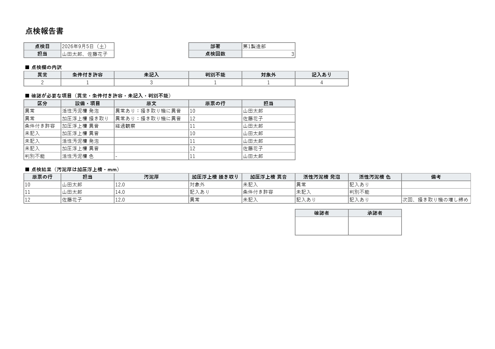

# 現場の Excel 帳票を、Excel だけで整えて書類にする VBA

工場の点検表のように、手で書き足されて崩れた Excel を読み、集計できる表に整える。
そこから、日ごとの点検報告書を Excel のシートと PDF で作る。
**Python もアドインも要らない**。Excel に `.bas` を取り込めば動く。

どの道具も、**同じ処理を Python でも書いて正解にし、VBA の出力を 1 セルずつ突き合わせてから**公開している。



| 道具 | ファイル | 突き合わせの結果 |
|---|---|---|
| 点検表を整える | `inspection/GenbaNorm.bas` | 25 行 × 9 列・全 225 セル一致 |
| 日ごとの点検報告書を作る | `inspection/GenbaReport.bas` | 12 日分・値 582 セル一致。PDF 12 件すべて 1 ページ |

**どちらも自作サンプル 1 セットでの確認で、実物の帳票では試していない**。受注した仕事の成果物でもない。

---

## Excel で試す

**リポジトリごと取り出す**（GitHub の「Code」→「Download ZIP」か、`git clone`）。
`.bas` はリポジトリの中では UTF-8 で持ち（GitHub の画面で読めるように）、取り出すと Shift-JIS・CRLF になる。
VBA エディタは Shift-JIS しか読めない。ZIP でも git でも Shift-JIS になることを確かめた。
**GitHub の画面から 1 ファイルずつ保存した `.bas` は UTF-8 のまま**なので、取り込むと日本語が化ける。

1. ZIP を展開する（または `git clone`）。使うのは `inspection/` の次の 4 つ
   - `GenbaNorm.bas` と `GenbaReport.bas`（マクロの本体。報告書のほうは、点検表を読むのに `GenbaNorm.bas` を使う）
   - `点検記録_2026-09.xlsx`（崩れた点検表の見本）
   - `点検報告書_ひな形.xlsx`（報告書の見た目）
2. Excel で空白のブックを開き、`Alt+F11` → ファイル → ファイルのインポートで、`.bas` を 2 つとも取り込む
3. `Alt+F8` で `SelfTest` と `ReportSelfTest` を実行し、どちらも OK と出ることを確かめる
4. `Normalize` を実行して点検表を選ぶ → 同じフォルダに `点検記録_2026-09_VBA.csv`（整えた表）ができる
5. `MakeReports` を実行し、「1/2」で点検表、「2/2」でひな形を選ぶ
   → `点検記録_2026-09_点検報告書/` に日ごとの PDF と、全日をまとめた `点検報告書.xlsx` ができる

点検表とひな形は読み取り専用で開き、書き換えない。
Windows 版 Excel（Microsoft 365・64bit）でだけ確かめた。Mac 版では試していない。

---

## 点検表を整える（`inspection/GenbaNorm.bas`）

点検表を整える依頼の多くは、**Python の入っていないパソコン**から来る。
Python で整えて渡すことはできても、次の月に同じ作業を繰り返せない。

そこで、日本語の社内文書 RAG（[rag-ja](https://github.com/DonguriTanukiyama/rag-ja)）の前処理 `genba_norm.py` のうち、
点検表の処理を **Excel だけで動く VBA** に写した。

点検欄の 1 マスを 6 つに分ける（記入あり／異常／条件付き許容／対象外／未記入／判別不能）。
**空欄を「異常なし」に混ぜない**のが中心で、点検していない欄が、異常の無かった欄に紛れないようにする。

### 結果

```
VBA == Python（25行 × 9列・全225セル一致）
```

**2 つの CSV はバイト単位で同一だった**。正解は Python が、VBA 版は Excel が、別々に書き出したもの。

自作サンプルが通った経路は次のとおり。

- 日付の書き方 7 通り（`2026/9/1` `2026-09-02` `9/3` `R8.9.5` `令和8年9月3日` `26.9.6` と、Excel の日付セル）
- 結合セル 14 か所、2 段の見出し
- 表記ゆれ（`山田` `さとう` `第一製造部`）、全角の数値（`１４．１`）、`約15`
- 点検欄の 6 分類すべて（記入あり 57 / 異常 11 / 条件付き許容 8 / 対象外 6 / 未記入 11 / 判別不能 7）

`SelfTest` はこれとは別に 27 件（2 月 30 日を日付にしない、`12.5` を日付にしない、など）。

### VBA で書くと、黙って結果がずれるところ

書く前に避けたもの。**どれもエラーにならず、答えだけが変わる**。

| | 何が起きるか | どうしたか |
|---|---|---|
| `StrConv(s, vbNarrow)` | カタカナまで半角になる（ポンプ → ﾎﾟﾝﾌﾟ） | 英数記号だけを自前で半角にする |
| `VBScript.RegExp` | Microsoft が VBScript の廃止を発表している | 正規表現を使わず 1 文字ずつ読む |
| セルに `2026-09-01` を書く | Excel が日付に変え、CSV に `2026/09/01` と出す | **先に文字列書式にしてから書く** |
| `Trim$` | 全角スペースを落とさない | 全角スペースも落とす関数を書いた |
| `.bas` を UTF-8 で保存 | VBA エディタで日本語が化ける | リポジトリは UTF-8、取り出すと Shift-JIS（`.gitattributes`） |
| 波ダッシュ（〜） | Shift-JIS を往復すると全角チルダ（～）になる | ソースに書かない。**実際に 1 回引っかかった** |

### 限界

- **自作サンプル 1 セットでの突き合わせ。実物の点検表では試していない**
- 表記ゆれの対応表（`山田` → `山田太郎` など）はコードに直接書いてある。**現場ごとに書き換えが要る**
- 日付・担当・汚泥厚・部署の列の位置は、このサンプルの並びに合わせてある
- 全角→半角は英数記号だけ。Python の NFKC が変える半角カナや丸数字は変えない
- 1904 年日付システム（Mac 由来）には未対応。Python 版と同じ

---

## 日ごとの点検報告書を作る（`inspection/GenbaReport.bas`）

`GenbaNorm.bas` と同じ関数（`ReadTable`）で点検表を読み、**1 日 1 枚の点検報告書**を Excel のシートと PDF で出す。

報告書の上には、その日の点検欄の内訳（6 分類の件数）を置く。
その下に**確認が必要な項目**（異常・条件付き許容・未記入・判別不能）を、原文と原票の行番号をつけて並べる。

見た目はコードではなく、**ひな形のブック**（`inspection/点検報告書_ひな形.xlsx`）で決める。
`{日付}` `{担当}` `{異常}` のように書いたセルに値が入り、`{確認が必要な項目}` と `{点検結果}` の表は件数に合わせて下に伸びる。
レイアウトを変えるときは、ひな形を Excel で直す。

### 結果

```
報告書 VBA == Python（12日分・195欄・値 582セル一致）
PDF 12 件。すべて1ページ
```

**VBA が書いたつもりの値ではなく、報告書のセルから読み戻した値で突き合わせている**。
日付が文字列に化ける、`14.0` が `14` になる、といったずれは、読み戻さないと見えない。
12 日分の件数を足すと、整えた表の結果（記入あり 57 / 異常 11 / 条件付き許容 8 / 対象外 6 / 未記入 11 / 判別不能 7）と一致する。

### 数では見つからず、PDF を目で見て直したもの

PDF を画像にして、確認が必要な項目がいちばん多い日（7 件）と、1 件も無い日を見た。

| | 何が起きたか | どうしたか |
|---|---|---|
| 表に行を足す | 足した行に**罫線が写らなかった**（折り返しの設定は写った） | 足した行へ、ひな形の行を書式ごと写してから値を書く |
| タイトルと見出し | 狭い列で折り返し、「点検報／告書」と割れて 2 ページになった | 見出しは折り返さない。印刷は横 1 ページ・縦 1 ページ |
| 汚泥厚 | 単位が書かれていなかった | ひな形の見出しに「汚泥厚は加圧浮上槽・mm」と書く |

**このとき 582 セルの値はすべて正しかったが、罫線は消えていた**。数の突き合わせと、目で見る確認は別物。

### 試運転で起きたこと

- **点検表を選ぶ画面でひな形を選び、「日付不明」の報告書が 1 枚だけ黙ってできた**。
  いまは、点検欄の列が無いファイルを点検表に選ぶと、何も作らずに止まる。差し込み欄の無いファイルをひな形に選んでも止まる（わざと取り違えて、2 通りとも止まることを確かめた）
- 変数名に `eNum` と書き、Excel で「構文エラー」になった。VBA は大文字と小文字を区別しないので、予約語の `Enum` と同じになる。
  `tools/check_bas.py` は、予約語と同じ名前・同じ名前の二重宣言・文字コード・改行を、取り込む前に調べる。**コンパイルの代わりにはならない**

### 限界

- **自作サンプル 1 セット（12 日分）での突き合わせ。実物の点検表と、現場で使っている報告書の書式では試していない**
- ひな形は、よくある形を想定して作ったもの。**現場の書式に合わせる作業が要る**
- 1 日を 1 枚に収める設定なので、確認が必要な項目が多い日は文字が小さくなる
- 報告書は日付が出てきた順に並ぶ。日付が読めない行は「日付不明」の 1 枚にまとめる

---

## 確かめ方（Python が要る）

正解は Python 版に持たせる。`inspection/genba_norm.py` は
[rag-ja](https://github.com/DonguriTanukiyama/rag-ja) の `genba_norm.py` の写し（コミット `7d4603d` の時点）で、
VBA 版の正解を作るためだけに置いている。標準ライブラリだけで動く（openpyxl があれば使う）。

```
python inspection/oracle.py            # 正解を作る → 点検記録_2026-09_正解.csv と _報告書_正解.csv
（Excel で Normalize と MakeReports）     # → _VBA.csv と _報告書_VBA.csv、_点検報告書/
python inspection/compare.py           # 整えた表を 1 セルずつ突き合わせる
python inspection/compare.py --report  # 報告書を突き合わせ、PDF の数とページ数を数える（ページ数は pypdf があれば）
python inspection/compare.py --demo    # 突き合わせそのものの自己確認
python tools/check_bas.py              # .bas を Excel に取り込む前の検査
```

一致しないセルは、行・列・正解・VBA の値を全部出す。件数だけで済ませない。

---

## ライセンス

MIT
